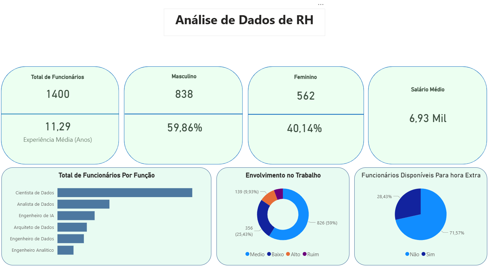

# 📊 Análise de Dados de RH com Power BI

## 🎯 Objetivo do Projeto

Desenvolver um dashboard interativo para análise estratégica de dados do setor de Recursos Humanos, permitindo uma visão consolidada sobre estrutura organizacional, perfil dos colaboradores, engajamento e indicadores salariais.

---

## 🛠 Ferramentas Utilizadas

- Power BI
- DAX para criação de medidas
- Power Query para transformação de dados
- Criação de KPIs e indicadores percentuais
- Visualizações interativas

---

## 📌 Indicadores Desenvolvidos

- Total de Funcionários
- Tempo Médio de Experiência (anos)
- Média Salarial Mensal
- Distribuição por Gênero (Total e Percentual)
- Total de Funcionários por Função
- Comparação entre cargos estratégicos da área de dados
- Percentual de Funcionários Disponíveis para Hora Extra
- Classificação de Envolvimento no Trabalho:
  - Ruim
  - Baixo
  - Médio
  - Alto

---

## 📈 Análise para Promoções

Cálculo adicional realizado com base no tempo de experiência dos colaboradores, identificando:

- Total de funcionários elegíveis para promoção
- Percentual em relação ao total da empresa

---

# 📷 Visualizações do Dashboard

---

# 📊 Principais Análises Possíveis

- Avaliação da estrutura de gênero na organização
- Identificação de funções com maior concentração de colaboradores
- Análise do nível médio de experiência da equipe
- Monitoramento do engajamento organizacional
- Planejamento estratégico de promoções
- Avaliação da disponibilidade para aumento de carga horária
